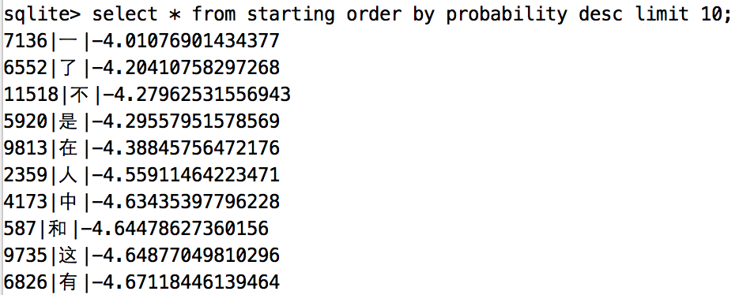
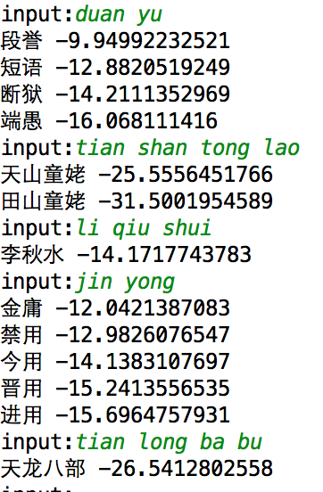
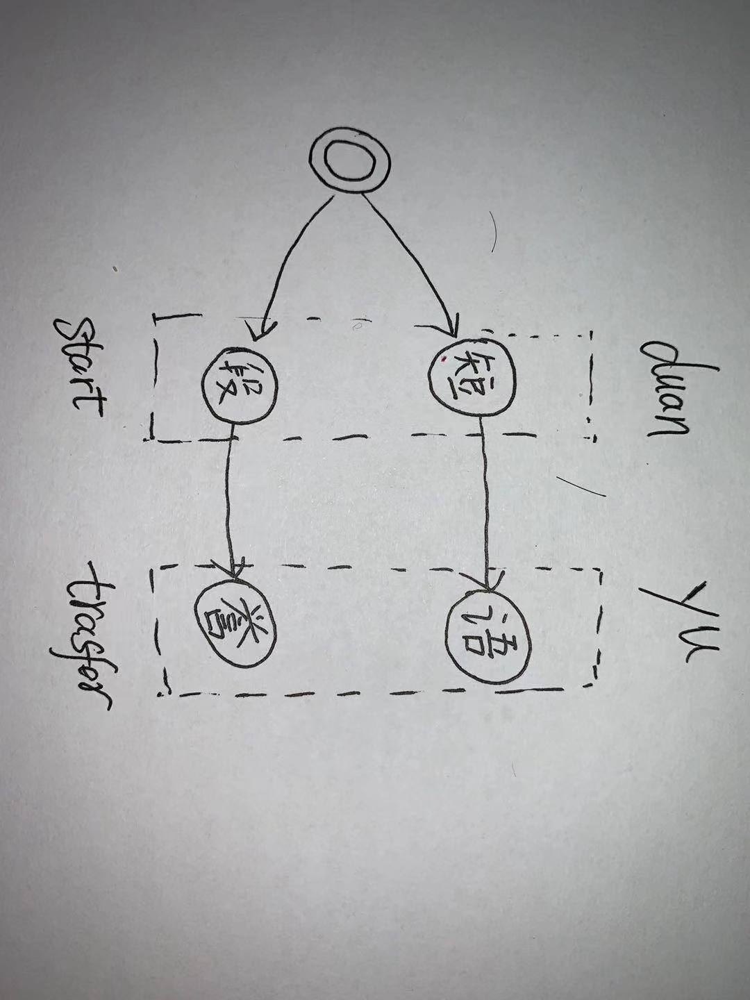

# Pinyin Input Method on HMM

一个简单拼音输入法

## 隐马尔可夫模型实现

### 原理简介

#### 隐马尔科夫模型

抄一段网上的定义：

隐马尔可夫模型 (Hidden Markov Model) 是一种统计模型，用来描述一个含有隐含未知参数的马尔可夫过程。其难点是从可观察的参数中确定该过程的隐含参数，然后利用这些参数来作进一步的分析。

拼音输入法中可观察的参数就是拼音，隐含的参数就是对应的汉字。

#### viterbi算法

参考[https://zh.wikipedia.org/wiki/维特比算法](https://zh.wikipedia.org/wiki/维特比算法)，思想是动态规划，代码比较简单就不赘述。

### 代码解释

#### model定义

代码见model/hmm_table.py文件，针对隐马尔科夫的三个概率矩阵，分别设计了三个数据表存储。这样的好处很明显，汉字的转移概率矩阵是一个非常大的稀疏矩阵，直接文件存储占用空间很大，并且加载的时候也只能一次性读入内存，不仅内存占用高而且加载速度慢。此外数据库的join操作非常方便viterbi算法中的概率计算。

数据表定义如下：

```python
class Transition(BaseModel):

    __tablename__ = 'transition'

    id = Column(Integer, primary_key=True)
    previous = Column(String(1), nullable=False)
    behind = Column(String(1), nullable=False)
    probability = Column(Float, nullable=False)


class Emission(BaseModel):

    __tablename__ = 'emission'

    id = Column(Integer, primary_key=True)
    character = Column(String(1), nullable=False)
    pinyin = Column(String(7), nullable=False)
    probability = Column(Float, nullable=False)


class Starting(BaseModel):

    __tablename__ = 'starting'

    id = Column(Integer, primary_key=True)
    character = Column(String(1), nullable=False)
    probability = Column(Float, nullable=False)

```

#### 模型生成

代码见 hmm/train.py文件，里面的init_starting，init_emission，init_transition分别对应于生成隐马尔科夫模型中的初始概率矩阵，发射概率矩阵，转移概率矩阵，并把生成的结果写入sqlite文件中。训练用到的数据集是结巴分词里的词库，因为没有训练长句子，最后运行的结果也证明只能适用于短句输入。

##### 初始概率矩阵

统计初始化概率矩阵，就是找出所有出现在词首的汉字，并统计它们出现在词首的次数，最后根据上述数据算出这些汉字出现在词首的概率，没统计的汉字就认为出现在词首的概率是0，不写入数据库。有一点注意的是为了防止概率计算的时候因为越算越小导致计算机无法比较，所有的概率都进行了自然对数运算。统计的结果如下：



##### 转移概率矩阵

此处用到的是最简单的一阶隐马尔科夫模型，即认为在一个句子里，每个汉字的出现只和它前面的的一个汉字有关，虽然简单粗暴，但已经可以满足大部分情况。统计的过程就是找出字典中每个汉字后面出现的汉字集合，并统计概率。因为这个概率矩阵非常的大，逐条数据写入数据库过慢，后续可以优化为批量写入，提高训练效率。结果如下：


上图展示的一后面出现概率最高的十个字，也挺符合日常习惯。

##### 发射概率矩阵

通俗点就是统计每个汉字对应的拼音以及在日常情况下的使用概率，已暴举例，它有两个读音：bao和pu，难点就是找bao和pu出现的概率。此处统计用到了pypinyin模块，把字典中的短语转换为拼音后进行概率统计，但是某些地方读音也不完全正确，最后运行的输入法会出现和拼音不匹配的结果。统计结果如下：


#### 模型训练

在 corpus 目录中， 保存了一份 dict.txt， 为删减版本的jieba词库。

此词库为默认训练词库。

另外一个为 dict.backup.txt为原来repo的词库， 太大，训练时间太长。 所以调试阶段不适用。

模型所在数据库有也对应两个
hmm.sqlite
hmm.backup.sqlite

运行命令
```
./bin/run.sh hmm/train.py
```

#### viterbi实现

代码建hmm/viterbi.py文件，此处会找到最多十个局部最优解，注意是十个局部最优解而不是十个全局最优解，但是这十个解中最优的那个是全局最优解，代码如下：

```python
def viterbi(pinyin_list):
    """
    viterbi算法实现输入法

    Args:
        pinyin_list (list): 拼音列表
    """

    # query the char-prob pair
    # char must in starting table, named as start_char
    # prob = start_char prob * emit_prob
    # emit_prob is the probability that start_char emit to the start_pinyin
    start_pinyin = pinyin_list[0]

    start_char = Emission.join_starting(start_pinyin)
    print("------ start_char -------")
    print(start_char)

    V = {char: prob for char, prob in start_char}

    print("------ V -------")
    print(V)

    print("\r\n")

    # let's count from the second pinyin to calc viterbi matrix
    for i in range(1, len(pinyin_list)):
        pinyin = pinyin_list[i]

        print("------ i -------")
        print(i)

        print("------ pinyin -------")
        print(pinyin)

        prob_map = {}

        for phrase, prob in V.iteritems():
            print("------ phrase -------")
            print(phrase)

            print("------ prob -------")
            print(prob)

            prev_char = phrase[-1]

            # only get the most possible next_char, with highest probability
            result = Transition.join_emission(pinyin, prev_char)
            print("------ result -------")
            print(result)

            if not result:
                continue

            # next_prob = transfer probability(pre_char -> next_char) * emission probability(next_char -> pinyin)
            next_char, next_prob = result
            print("-------- next_char --------")
            print(next_char)

            # make new V of new char path, ie phrase.
            prob_map[phrase + next_char] = next_prob + prob

        if prob_map:
            # update V, in order to do further research
            V = prob_map
        else:
            return V

        print("\r\n")

    return V
```

### 结果展示

运行文件，简单的展示一下运行结果：

```
./bin/run.sh hmm/viterbi.py
```





输出
```
root@xxx:~/win10/mine/pinyin_input_method# ./bin/run.sh hmm/viterbi.py
PYTHONPATH=/usr/local/spark/python:/usr/local/spark/python/lib/py4j-0.10.4-src.zip::/root/win10/mine/pinyin_input_method
input:duan yu
------ start_char -------
[(u'\u77ed', -8.848355540206123), (u'\u6bb5', -8.848355540206123)]
------ V -------
{u'\u6bb5': -8.848355540206123, u'\u77ed': -8.848355540206123}


------ i -------
1
------ pinyin -------
yu
------ phrase -------
段
------ prob -------
-8.84835554021
------ result -------
(u'\u8a89', -0.1840036429769394)
-------- next_char --------
誉
------ phrase -------
短
------ prob -------
-8.84835554021
------ result -------
(u'\u8bed', 0.0)
-------- next_char --------
语


短语 -8.84835554021
段誉 -9.03235918318
input:
bye bye

```


问题统计：

1. 统计字典生成转移矩阵写入数据库的速度太慢，运行一次要将近十分钟。
2. 发射概率矩阵数据不准确，总有一些汉字的拼音不匹配。
3. 训练集太小，实现的输入法不适用于长句子。
